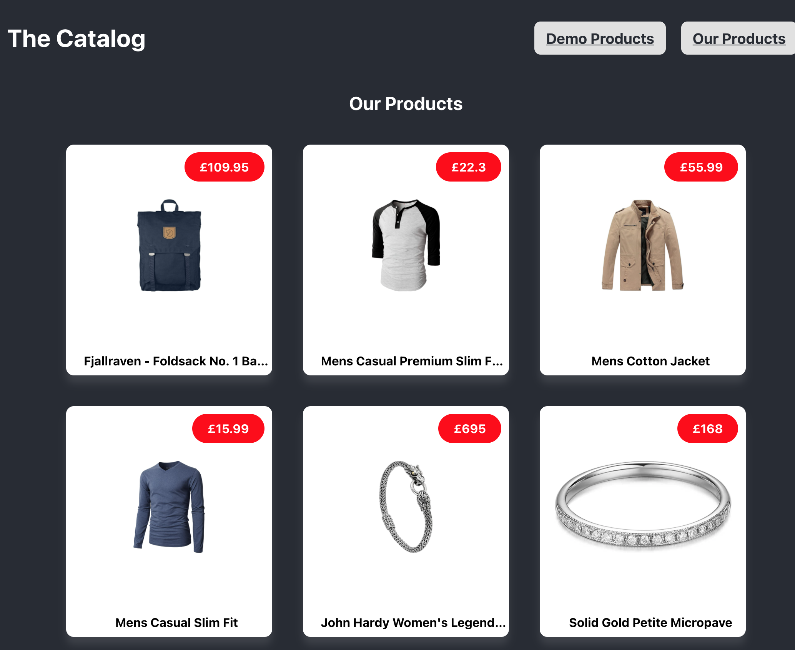

# Spring Boot Interview Coding

A coding exercise to resolve a few simple problems in Java Spring and plain old JS.

## Problem 1
Some of the tests are currently failing... please can you fix the code to make the tests pass

## Problem 2 (Frontend)
When you launch the application we are supposed to see 10 products on the page, 
however only one is displayed - investigate the cause of the problem and fix

## Problem 3 (React)
As part of our UI upgrade we are building our frontend in ReactJS, however it's not loading
properly... please can you investigate

The Demo Products page should look like this

